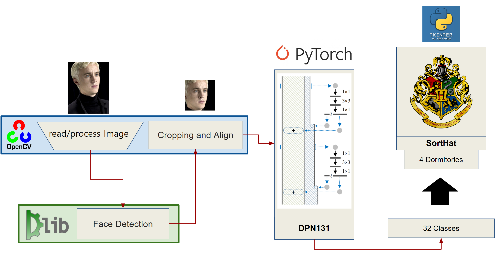
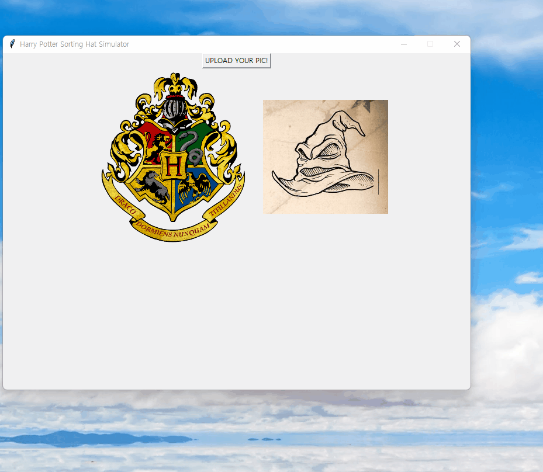
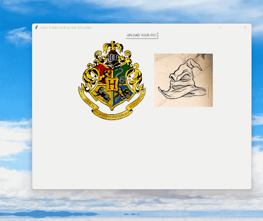
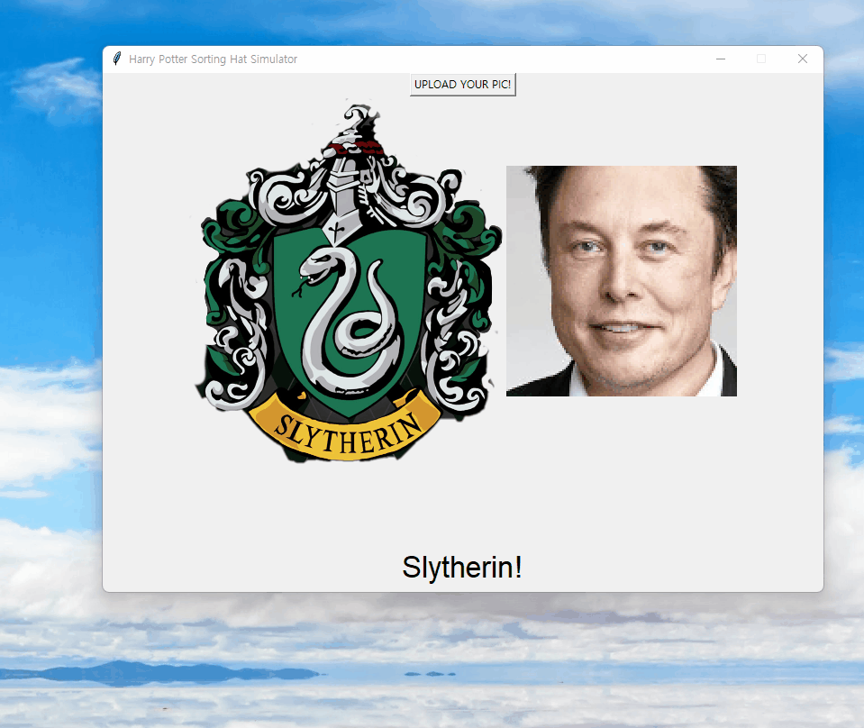
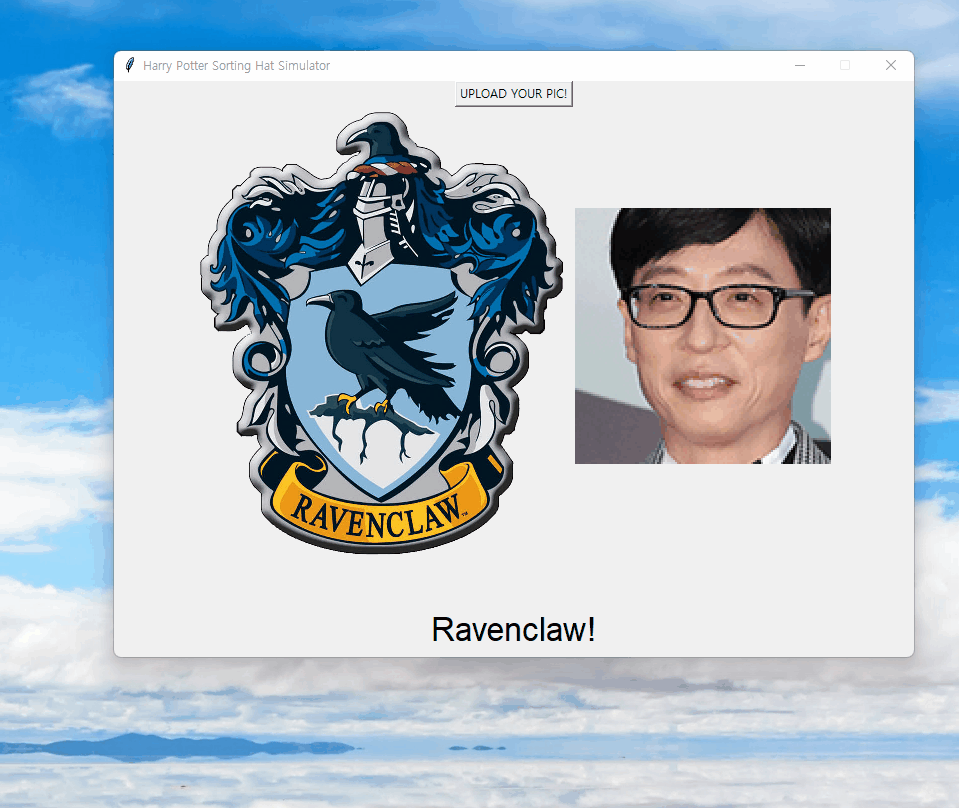
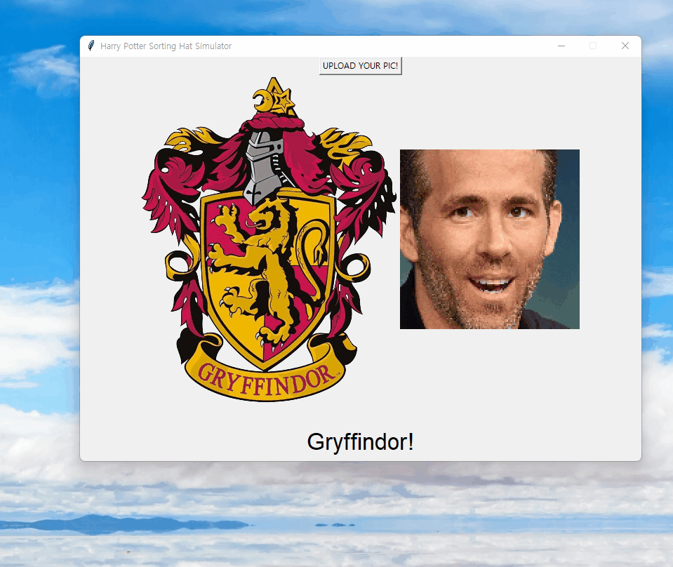

# Harry Potter's The Sorting Hat
 Kyunghee University Practical Machine Learning Project  
 
## Authors
 * Won Jong-seo [@Wawtuh](https://github.com/Wawtuh)
 * Cho Moon-gi [@siryuon](https://github.com/siryuon)

## Results
  
  
  

## Requirment
 * transformers
 * torch
 * torchvision
 * numpy
 * dlib
 * python-opencv (cv2)
 * tkinter
 * PIL

## Introduce
Enter your image, and get assigned the Hogwarts residence that best suits you!

## Usage
You have to download flies at this link(https://drive.google.com/drive/folders/1xsU0z_zFFvBHRGaIAzo5Gex4V6MKZM6o) and place them at 'Main' folder  
Run SortHat.py in Main folder
> python SortHat.py

## Directory
Make own dataset(with mask image and without mask image) like below. (Folder name is just example)
```
HarryPotterSortingHat_mlvc
├── Data (Image files)
│   ├── Gryffindor
│   ├── Hufflepuff
│   ├── Ravenclaw
│   └── Slytherin
├── Main
│   ├── img (Img files use in tkinter)
│   ├── Hogwart.jpg
│   ├── SortHat.py (Main Program)
│   ├── adaptive_avgmax_pool.py
│   ├── align_faces.py
│   ├── dpn.py
│   ├── facealigner.py
│   ├── helpers.py
│   ├── shape_predictor_68_face_landmakrs.dat.bz2
│   └── shape_predictor_68_face_landmarks.dat
├── .gitignore
├── readme.md
├── train.py
└── util.py
```    
